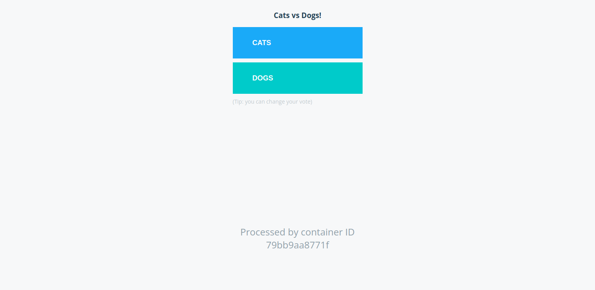
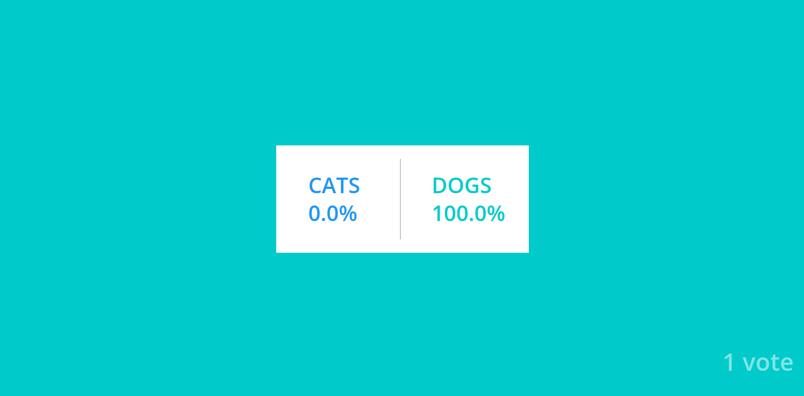
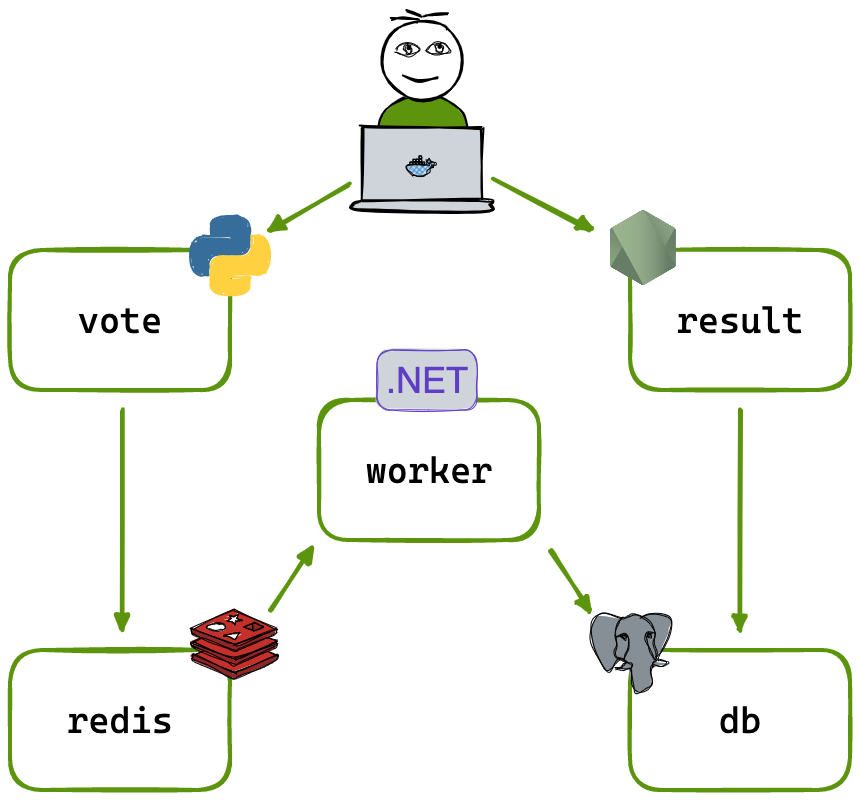

# Voting app

A simple distributed application running across multiple Docker containers.

This repository is a clone of [dockersamples/example-voting-app](https://github.com/dockersamples/example-voting-app), created for learning and experimenting with Docker containers. It serves as a practical hands-on project to understand containerization.




## Architecture



*Diagram from original repository.*

- **Front-end web app (Python)**: Allows users to vote between dog or cat.
- **Redis**: Acts as a queue to collect new votes.
- **Worker app (.NET)**: Consumes votes from the Redis queue and stores them in a database.
- **Postgres**: A database that stores the voting results.
- **Results web app (Node.js)**: Displays the voting results in real-time.

## Learning Objectives

This repository is a simplified version of the original project, with the main goals of:

- Learning Docker basics and commands.
- Building Docker images and running images available on Docker Hub.
- Setting up containers with port mapping.
- Linking containers.
- Manuall application setup.
- Automating the application setup with Docker Compose.

## Docker Basics

### **Containers**

- Containers are lightweight, standalone, and executable packages that include everything needed to run a piece of software, including the code, runtime, system tools, libraries, and settings.
- They are instances of Docker images that are isolated and have their own environments and set of processes.
- Unlike virtual machines, containers share the host system's kernel and resources, making them more efficient and faster to start.
- Containers are designed to run specific tasks or processes, rather than an entire operating system like virtual machines.

### **Docker Images**

- Docker images are read-only templates used to create containers. They include the application code, libraries, dependencies, and other files necessary for the application to run.
- An image can be thought of as a snapshot of a container's file system at a specific point in time.
- Images can be built from a set of instructions written in a Dockerfile, which specifies the base image, application code, and other dependencies.
- Docker images are stored in repositories, such as Docker Hub, from where they can be pulled to create new containers.

## **Some Useful Commands to Remember**

```bash
docker run [image]
# If the image is not available locally, it will download the image in the first run

docker ps
# List the running containers

docker ps -a
# List all running and previously stopped containers

docker stop [container id / name]
# Stop the container

docker rm [container id / name]
# Remove a container

docker images
# List images in the host

docker rmi [image]
# Remove the image from the host

docker pull [image]
# Get the image from Docker Hub

docker exec [container] [command]
# Execute a command in the Docker container

docker run -it centos bash
# Run the bash inside Centos

docker run --name [your_name] -d [image]
# Run a container with a name; -d is detach

docker run --name webapp -d nginx:1.14-alpine
# Example: Run a named container with a specific version of Nginx in detached mode

docker run [image]:[version]
# Specify a version; default is the latest version
# You can check the tags for version at Docker Hub

docker run -p [port]:[port container] [image]
# Example: docker run -p 8306:3306 mysql
# Needs port mapping

docker logs [container id / name]
# Check logs

docker inspect [container id]
# Inspect container; internal IP address
```

## Building the App Manually
We will build the app step-by-step by following the flow from the architecture diagram.

1. **Build the voting-app**
    - Navigate to the `vote` directory and build the voting-app:
    
    ```bash
    docker build . -t voting-app
    ```
    
    - Check if the image is locally available:
    
    ```bash
    docker images
    ```
    
    ```bash
    docker run -p 5000:80 voting-app
    ```
    
    - Check in your browser at http://localhost:5000 - you should see the webpage with options to vote for cat or dog.
2. **Set up Redis**
    
    ```bash
    docker run -d --name redis redis
    ```
    
    - If Redis is not available locally, it will automatically download from Docker Hub.
    - Check if it is running with:
    
    ```bash
    docker ps
    ```
    
3. **Build and run the worker app**
    - Navigate to the `worker` directory and build the worker app:
    
    ```bash
    docker build . -t worker-app
    ```
    
    - Run the worker app, linking it to the Redis container:
    
    ```bash
    docker run -d --name worker-app --link redis:redis worker-apps
    ```
    
4. **Set up PostgreSQL**
    
    ```
    docker run -d --name db -e POSTGRES_PASSWORD=postgres db
    ```
    
    - Check if it is running with `docker ps`
5. **Build and run the result app**
    - Navigate to the `result` directory and build the result app:
    
    ```bash
    docker build . -t result-app
    ```
    
    - Run the result app, linking it to the PostgreSQL container:
    
    ```bash
    docker run -d --name result-app -p 5001:80 --link db:db result-app
    ```
    
    - Check in your browser at http://localhost:5001 to see the voting results in real-time.
6. **Ensure all services are running**
    
    ```bash
    docker ps
    ```
    
    You should see containers for `voting-app`, `redis`, `worker-app`, `db`, and `result-app` all running.

# Buiding the App Automatically with Docker 
Docker Compose allows you to define and manage multi-container Docker applications using a single docker-compose.yml file. 

1. Create a docker-compose.yml file with the following content:
    ```yml
    services:
    redis:
        image: redis

    db:
        image: postgres:15
        environment:
        POSTGRES_PASSWORD: postgres

    vote:
        image: voting-app
        ports:
        - 5000:80
        links:
        - redis

    worker:
        image: worker-app
        links:
        - redis
        - db

    result:
        image: result-app
        ports:
        - 5001:80
        links:
        - db
    ```
    - **services**
        - defines the different services that make up your application
    - **image**
        - specifies the Docker image to use
    - **environment**
        - sets environment variables. In this example, the PostgreSQL password.
    - **links**
        - link a service to another service
    - **ports**
        - maps port of the host to a port in the container

2. Run the application with Docker Compose:
    ```bash
    docker-compose up 
    ```
3. Verify all services are running
    ```bash
    docker-compose ps
    ```

## Notes
The voting application only accepts one vote per client browser. It does not register additional votes if a vote has already been submitted from a client.

This isn't an example of a properly architected perfectly designed distributed app... it's just a simple
example of the various types of pieces and languages you might see (queues, persistent data, etc), and how to
deal with them in Docker at a basic level.